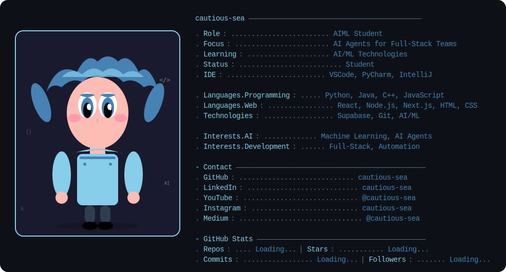

<!--
    Hey there, I'm Cautious-Sea!
    Happy to see you here exploring my README code
    Feel free to inspire!
    
    But may I please ask you to follow me in return? Just a click!
    You may also want to connect with me on LinkedIn @cautious-sea :))
-->

 

<!--
    Dynamic Terminal SVG like Andrew's
-->

    

<!--
     My mission, because I'm a superhero!
-->

### My Mission
As an AIML student passionate about artificial intelligence and machine learning, I'm dedicated to creating intelligent solutions that bridge the gap between complex AI technologies and practical full-stack applications. My goal is to develop AI agents that empower development teams, streamline workflows, and make advanced AI accessible to everyone. I believe in the power of technology to solve real-world problems and am committed to building the future of intelligent software systems.

<!--
     This is the list of my skills and tools I am studying!
-->

### Main Skills

### Currently Learning

**Creating AI agents for full-stack development teams**

<!--
     Fast links to my socials!
-->

### Connect with me!

    
    
    
    
    
    

<!--
     Oh, hello there, recruiters!
-->

### Looking for Opportunities?
> [!IMPORTANT]
> I'm currently seeking internships and entry-level positions in AI/ML and full-stack development. Let's connect!

<a href="https://drive.google.com/file/d/your-resume-id/view" download>📄 Download my resume</a>

<!--
     Thanks for being my guest <3
-->
